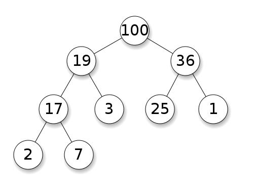

# Heaps

### Patrick Malolepszy - Nov. 13 / 2017

## Overview

* What is a heap?
* When is it appropriate to use one?
* How to implement and work with heaps?
* Complexities!
* Sample question.

## What is a Heap?

* Binary Heaps are a **complete** **binary** tree data-structure used to efficiently store ordered data
* Heaps store values with the following “Heap” property:
    * For a node A, its children B and C (if it has them), have values less than or equal to A 
    * (val(A) >= val(B) and val(A) >= val(C)
* The above rule is for max heaps, but can easily be changed to create min heaps.

### Complete Tree

> “All levels of the tree, except possibly the last one (deepest), are fully filled, and, if the last level of the tree is not complete, the nodes of that level are filled from left to right.”
- wikipedia

### Max Heap Example

