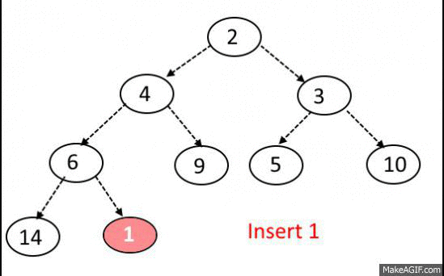

# Heaps

### Patrick Malolepszy - Nov. 13 / 2017


## Overview

* What is a heap?
* Implementation.
* Complexities!
* When to use one?
* Sample question.


## What is a Heap?

* Binary Heaps are a **complete** **binary** tree data-structure used to efficiently store ordered data
* Heaps store values with the following “Heap” property:
    * For a node A, its children B and C (if it has them), have values less than or equal to A 
    * (val(A) >= val(B) and val(A) >= val(C)
* The above rule is for max heaps, but can easily be changed to create min heaps.


### Complete Tree

> “All levels of the tree, except possibly the last one (deepest), are fully filled, and, if the last level of the tree is not complete, the nodes of that level are filled from left to right.”
- wikipedia


### Max Heap Example


### Min heap, max heap


## When to use a heap?


## Implementation

* Since the Heap must be a complete binary tree, we can actually store the data in an array.
* Avoids the overhead of a tree-based implementations (no pointers to other nodes).


### Implicit Data Structure

> "An implicit data structure or space-efficient data structure is a data structure that stores very little information other than the main or required data: a data structure that requires low overhead." - wikipedia


### Indexing elements in array as a complete binary tree:

For a node at index i, we can find it’s left and right children:

* left_child = (i * 2) + 1
* right_child = (i * 2) + 2


### Creating heap class

Our heap class needs only two member variables:

* The array containing the data
* An index representing the current “size” of the array, used for where to insert elements into the heap


```java
public class Heap <T extends Comparable<T>> {

    private List<T> data;

    // Constructor:
    public Heap() {
        this.data = new ArrayList<>();
    }
}
```


### Accessor Methods:

```java
public void push(T n) {
    data.add(n);
    bubbleUp(data.size() - 1);
}

public T top() {
    return data.get(0);
}

public void pop() {
    data.set(0, data.remove(data.size()-1));
    bubbleDown(0);
}
```


### Bubble Up:

```java
private void bubbleUp(int i) {
    int parent = i / 2;
    while (i > 0 && (data.get(i).compareTo(data.get(parent)) > 0 )) {
        Collections.swap(data, i, parent);
        i = parent;
        parent = i / 2;
    }
}
```





### Bubble Down:

```java
private void bubbleDown(int i) {
    int left = 2 * i + 1;
    int right = 2 * i + 2;
    int next = i;

    if ((left < data.size()) && (data.get(left).compareTo(data.get(i)) > 0)) {
        next = left;
    }
    if ((right < data.size()) && (data.get(right).compareTo(data.get(next)) > 0)) {
        next = right;
    }

    if (next != i) {
        Collections.swap(data, i, next);
        bubbleDown(next);
    }
}
```


### Testing

```java
private Heap<Integer> heap;

@Before
public void init() {
    heap = new Heap<>();
    heap.push(3);
    heap.push(2);
    heap.push(5);
    heap.push(4);
}
```


### Testing

```java
@Test
public void TopOfHeapShouldBeMaxElement() {
    // Arrange
    int  expected = 5;
    // Act
    int result = heap.top();
    // Assert
    Assert.assertEquals(expected, result);
}
```


### Testing

```java
@Test
public void PoppingElementShouldRemoveMax() {
    // Arrange
    int expected = 4; // 2nd largest
    // Act
    heap.pop();
    int result = heap.top();
    // Assert
    Assert.assertEquals(expected, result);
}
```


### Whole Class:

(Also see [my github](https://github.com/PatrickMalolepszy/Technical-Interview-Prep-Lectures) for code)

```java 
// File: Heap.java
import java.util.ArrayList;
import java.util.Collections;
import java.util.List;

public class Heap <T extends Comparable<T>> {

    private List<T> data;

    // Constructor:
    public Heap() {
        this.data = new ArrayList<>();
    }

    // Accessor Methods:
    public void push(T n) {
        data.add(n);
        bubbleUp(data.size() - 1);
    }

    public T top() {
        return data.get(0);
    }

    public void pop() {
        data.set(0, data.remove(data.size()-1));
        bubbleDown(0);
    }

    // Heap Methods -> used to keep satisfy heap property
    private void bubbleUp(int i) {
        int parent = i / 2;
        while (i > 0 && (data.get(i).compareTo(data.get(parent)) > 0 )) {
            Collections.swap(data, i, parent);
            i = parent;
            parent = i / 2;
        }
    }

    private void bubbleDown(int i) {
        int left = 2 * i + 1;
        int right = 2 * i + 2;
        int next = i;

        if ((left < data.size()) && (data.get(left).compareTo(data.get(i)) > 0)) {
            next = left;
        }
        if ((right < data.size()) && (data.get(right).compareTo(data.get(next)) > 0)) {
            next = right;
        }

        if (next != i) {
            Collections.swap(data, i, next);
            bubbleDown(next);
        }
    }
}

// File: HeapTest.java
import org.junit.Assert;
import org.junit.Before;
import org.junit.Test;

public class HeapTest {

    private Heap<Integer> heap;

    @Before
    public void init() {
        heap = new Heap<>();
        heap.push(3);
        heap.push(2);
        heap.push(5);
        heap.push(4);
    }

    @Test
    public void TopOfHeapShouldBeMaxElement() {
        // Arrange
        int  expected = 5;
        // Act
        int result = heap.top();
        // Assert
        Assert.assertEquals(expected, result);
    }

    @Test
    public void PoppingElementShouldRemoveMax() {
        // Arrange
        int expected = 4; // 2nd largest
        // Act
        heap.pop();
        int result = heap.top();
        // Assert
        Assert.assertEquals(expected, result);
    }
}
```


## Complexity

* Pushing (inserting) an element into the heap:
    * First we put it at the bottom rightmost position in the tree -> O(1)
    * We bubble up the element to find its appropriate spot and maintain heap property -> O(log(n))
* Popping (removing max/min) element from the heap:
    * Remove top element and replace it with the bottom rightmost element in the tree -> O(1)
    * Bubble down the root element --> O(log(n))
* Get the max/min element:
    * O(1)


## When to use Heaps?

* Can act like a priority queue
* Need to get max/min elements & n is large.

* Should not need to implement in the interview unless requested.
    * Use your languages built in priority queue or heap instead.
    * Eg. Java's PriorityQueue or Python's heapify.


## Sample Question

Given a non-empty list of words, return the frequencies of the k most frequent words.
Your answer should be sorted by frequency from highest to lowest. 


Eg.

Input: ["the", "day", "is", "sunny", "the", "the", "the", "sunny", "is", "is"], k = 2

Output: [4, 3]


### Solution

```java
public static List<Integer> kFrequentWords(List<String> words, int k) {
    Map<String, Integer> wordCounts = new HashMap<>();

    // Count the words: O(n)
    for(String word : words) {
        if (wordCounts.containsKey(word)) {
            int current = wordCounts.get(word);
            wordCounts.put(word, current + 1);
        } else {
            wordCounts.put(word, 1);
        }
    }

    // Put counts into heap: O(n*log(k))
    PriorityQueue<Integer> heap = new PriorityQueue<>();
    for (Map.Entry<String, Integer> entry : wordCounts.entrySet()) {
        heap.add(entry.getValue());
        if (heap.size() > k) heap.remove();
    }

    // pop every element of heap and into ans list: O(k log(k))
    List<Integer> ans = new ArrayList<>();
    while (heap.size() > 0) {
        ans.add(heap.peek());
        heap.remove();
    }
    
    return ans;
}
```


## Other ways to solve...

* Sorting -> O(n*Log(n))
* Selection Algorithm -> O(n)


## Q & A


## Thank you!