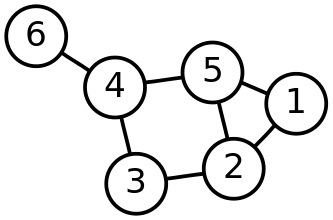
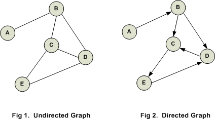
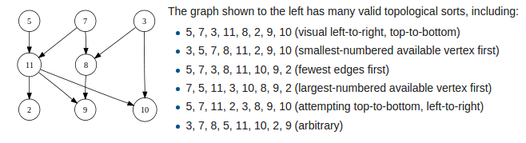

## Graphs and Topological Sort

#### By: Patrick Malolepszy

#### Slides based on David Valleau's slides

#### November 20, 2017


## Graphs

- Similar to trees, graphs are an important data structure that show up in many real world problems and are common in interviews
- As mentioned in the presentation about trees, the following traversal techniques also work for graphs:
    - Depth-first search
    - Breadth-first search

[Go here to revisit graph traversal](http://malolepp.myweb.cs.uwindsor.ca/oct23.html#/4)


## What Are Graphs?

- Graphs are composed of two things:
    - A set of “Vertices”, essentially points or nodes
    - A set of “Edges”, a connection between two vertices
- Vertices = {1, 2, 3, 4, 5, 6}
- Edges = {{1,5}, {1,2}, {2,3}, {2,5}, {3, 4}, {4, 5}, {4, 6}}




## Directed Graphs

- The distinction between an undirected graph vs a directed graph is simple:
    - Edges between two vertices are “directed” meaning that the connection only goes in one direction
    - Edges are represented as a set of ordered pairs instead of a set of unordered pairs.
- For example, the web can be thought of as a directed graph:
    - Web pages are the “vertices”
    - Links are directed “edges”





## Topological Sort

- Topological sort is a way to write a linear ordering of the vertices of a directed graph such that for every directed edge u->v in the graph, u comes before v in the ordering.




## Topological Sort

- Topological sort only works for directed-acyclic graphs (directed graphs that do not have any cycles)
- It is used frequently in package managers and build systems in order to manage dependencies, and usually it is involved in interview questions of this type.


## Implementation

1. Find all nodes which do not have any incoming edges (this will be the first in our list, we can get them out of the way first).
1. remove each of of the found nodes outbound edges.
1. repeat 1-2 until all nodes are visited.

This is essentially an altered breadth first search.


```java
// First update all nodes with number of inbound connections:
for (Node<T> n : nodes) {
    for(Node<T> m : n.adjacentNodes) {
        m.inBoundNodes++;
    }
}
```


```java
/* Find all nodes with no incoming connections,
        and to the queue of node to be processed. */
for (Node<T> n : nodes) {
    if (n.inBoundNodes == 0) {
        processNext.add(n);
    }
}
```


```java
/* process each node,
    decrement its adjacent nodes inbound nodes,
        if the adjacent node has 0 inbound edges, add it to the queue to be processed.*/
while (!processNext.isEmpty()) {
    Node<T> n = processNext.remove();
    for (Node<T> m : n.adjacentNodes) {
        m.inBoundNodes--;
        if (m.inBoundNodes == 0 ) {
            processNext.add(m);
        }
    }
    topologicalOrdering.add(n.data);
}
```


#### All of the code:  (also on [Github](https://github.com/PatrickMalolepszy/Technical-Interview-Prep-Lectures))
```java
// Graph.java
import java.util.*;

public class Graph<T> {

    List<Node<T>> nodes;

    public List<T> topologicalSort() {

        List<T> topologicalOrdering = new ArrayList<>();
        Queue<Node<T>> processNext = new LinkedList<>();

        // First update all nodes with number of inbound connections:
        for (Node<T> n : nodes) {
            for(Node<T> m : n.adjacentNodes) {
                m.inBoundNodes++;
            }
        }

        /* Find all nodes with no incoming connections,
             and to the queue of node to be processed. */
        for (Node<T> n : nodes) {
            if (n.inBoundNodes == 0) {
                processNext.add(n);
            }
        }

        /* process each node,
            decrement its adjacent nodes inbound nodes,
             if the adjacent node has 0 inbound edges, add it to the queue to be processed.*/
        while (!processNext.isEmpty()) {
            Node<T> n = processNext.remove();
            for (Node<T> m : n.adjacentNodes) {
                m.inBoundNodes--;
                if (m.inBoundNodes == 0 ) {
                    processNext.add(m);
                }
            }
            topologicalOrdering.add(n.data);
        }

        return topologicalOrdering;
    }
}

// Node.java
import java.util.ArrayList;
import java.util.List;

class Node<T> {
    T data;
    List<Node<T>> adjacentNodes;
    int inBoundNodes;

    public Node(T data) {
        this.data = data;
        adjacentNodes = new ArrayList<>();
    }
}

// GraphTest.java
import org.junit.Test;

import java.util.ArrayList;
import java.util.List;

public class GraphTest {

    @Test
    public void testTopSort() {
        Graph<Integer> graph = new Graph<>();
        Node<Integer> n1 = new Node<>(1);
        Node<Integer> n2 = new Node<>(2);
        Node<Integer> n3 = new Node<>(3);
        Node<Integer> n4 = new Node<>(4);
        Node<Integer> n5 = new Node<>(5);
        Node<Integer> n6 = new Node<>(6);
        n1.adjacentNodes.add(n2);
        n2.adjacentNodes.add(n3);
        n2.adjacentNodes.add(n5);
        n4.adjacentNodes.add(n2);
        n5.adjacentNodes.add(n6);
        n6.adjacentNodes.add(n3);
        List<Node<Integer>> graphNodes = new ArrayList<>();
        graphNodes.add(n1);
        graphNodes.add(n2);
        graphNodes.add(n3);
        graphNodes.add(n4);
        graphNodes.add(n5);
        graphNodes.add(n6);
        graph.nodes = graphNodes;
        List<Integer> topSorted = graph.topologicalSort();
        System.out.println(topSorted);
    }
}
```


### Example question:

Your friend wants to build his brand new gaming desktop so he can play Overwatch with you. He has already ordered and received all of the parts, but unfortunately they came with odd instructions to put everything together. Each part provides a list of parts which can be installed after it is added to the system. Help him determine the order to build his computer.


```
Sample Input:
Motherboard -> GPU, CPU, RAM
CPU -> HeatSink
PowerSupply -> Motherboard, GPU, CPU, HHD
PowerSupply, Motherboard, GPU, CPU, HHD, RAM, HeatSink -> Windows
Windows -> Overwatch

Sample Output:
PowerSupply, Motherboard, RAM, CPU, HeatSink, GPU, Windows, Overwatch
```


## Thank you

#### Make sure to checkout [POTW](https://potw.cs.uwindsor.ca/)


