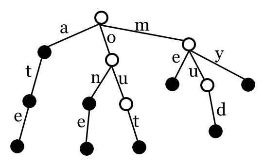

## Tries

Patrick Malolepszy

University of Windsor - Oct 29, 2017

Based on Slides from David Valleau


## What is a Trie?

- A “trie” or “prefix tree” is a tree that is used to represent sequential data without any redundancy.
- Most of the time tries are used with strings:
- We can represent a dictionary using a trie, and use it to implement a spell-checker
- Tries are an efficient way to store sequences of data that share a common prefix. This is because all of the elements which share a common prefix also share the nodes in the tree!





## Trie Vs Hashmap

```java
Trie trie = new Trie();
trie.insert("patrick");
boolean result = trie.is_word("patrick");
```

```java
Map<String, Boolean> hashMap = new HashMap<>();
hashMap.put("patrick", true);
boolean result = hashMap.get("patrick");
```


## Trie Implementation


## Basic node structure
```java
private class trie_node {
    boolean word_end;
    Map<Character, trie_node> children;

    public trie_node() {
        word_end = false;
        this.children = new HashMap<>();
    }
}
```


## Insert
```java
public void insert(String s) {
    trie_node cur = root;
    for (int i = 0 ; i < s.length() ; i++) {
        char c = Character.toLowerCase(s.charAt(i));
        if (!cur.children.containsKey(c)) {
            cur.children.put(c, new trie_node());
        }
        cur = cur.children.get(c);
    }
    cur.word_end = true;
}
```


## Prefix Checking
```java
boolean has_prefix(String s) {
    trie_node cur = root;
    for (int i = 0 ; i < s.length() ; i++) {
        char c = Character.toLowerCase(s.charAt(i));
        if (cur.word_end) {
            return true;
        }
        if (!cur.children.containsKey(c)) {
            return false;
        }
        cur = cur.children.get(c);
    }
    return false;
}
```


## Word Checking
```java
boolean is_word(String s) {
    trie_node cur = root;
    for (int i = 0 ; i < s.length() ; i++) {
        char c = Character.toLowerCase(s.charAt(i));
        if (!cur.children.containsKey(c)) {
            return false;
        }
        cur = cur.children.get(c);
    }
    return cur.word_end;
}
```


## Full Example Class
```java
import java.util.HashMap;
import java.util.Map;

public class Trie {

    private class trie_node {
        boolean word_end;
        Map<Character, trie_node> children;

        public trie_node() {
            word_end = false;
            this.children = new HashMap<>();
        }
    }

    private trie_node root;

    public Trie() {
        root = new trie_node();
    }

    public void insert(String s) {
        trie_node cur = root;
        for (int i = 0 ; i < s.length() ; i++) {
            char c = Character.toLowerCase(s.charAt(i));
            if (!cur.children.containsKey(c)) {
                cur.children.put(c, new trie_node());
            }
            cur = cur.children.get(c);
        }
        cur.word_end = true;
    }

    boolean has_prefix(String s) {
        trie_node cur = root;
        for (int i = 0 ; i < s.length() ; i++) {
            char c = Character.toLowerCase(s.charAt(i));
            if (cur.word_end) {
                return true;
            }
            if (!cur.children.containsKey(c)) {
                return false;
            }
            cur = cur.children.get(c);
        }
        return false;
    }

    boolean is_word(String s) {
        trie_node cur = root;
        for (int i = 0 ; i < s.length() ; i++) {
            char c = Character.toLowerCase(s.charAt(i));
            if (!cur.children.containsKey(c)) {
                return false;
            }
            cur = cur.children.get(c);
        }
        return cur.word_end;
    }

}
```


## Unit Testing
```java
@Test
public void TrieIsWord_WithWord_ShouldReturnTrue() {
    // Arrange
    Trie trie = new Trie();
    trie.insert("patrick");

    // Act
    boolean result = trie.is_word("patrick");

    // Assert
    Assert.assertTrue(result);
}
```


### Negative Case
```java
@Test
public void TrieIsWord_WithoutWord_ShouldReturnFalse() {
    // Arrange
    Trie trie = new Trie();

    // Act
    boolean result = trie.is_word("patrick");

    // Assert
    Assert.assertFalse(result);
}
```


## Example Question

Given a list of phone numbers, determine if it is consistent in the sense that no number is a prefix of another.

Example:

- 911
- 976 259 9913
- 911 325 4321

In this case, the phone list is not consistent as the first number is a prefix of the third.


## Solution
```java
Scanner scanner = new Scanner(System.in);
Trie phoneNumbers = new Trie();
while (scanner.hasNext()) {
    String number = scanner.nextLine();
    if(phoneNumbers.has_prefix(number)) {
        return false;
    }
    phoneNumbers.insert(number);
}
return true;
```


## Thank you!

Good luck on interviews and see you next week.